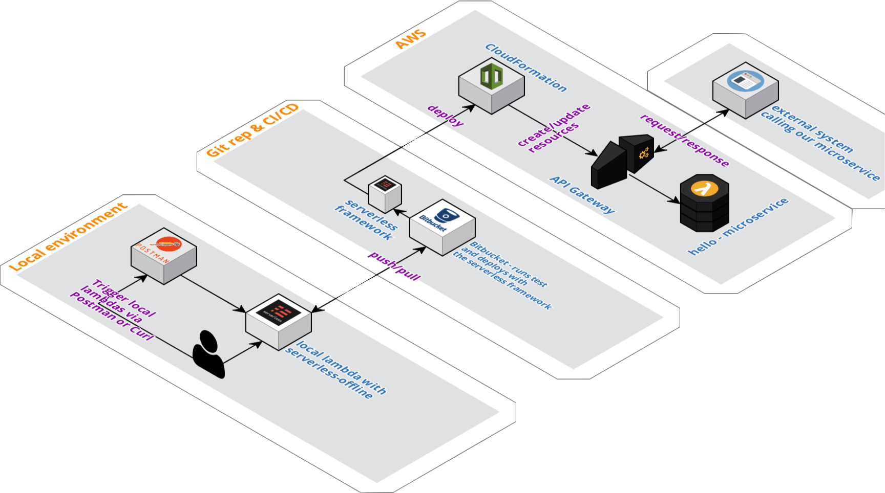

# tq-onboarding
*In this repo you will find code and resources that is used as a foundation in most of the software development team at TIQQE.*

**Visual Studio Code (OSX, Linux, Windows) is recommended as IDE**

## Prerequisties
* nodejs (recommended version `LTS` at the time of writing: `12.14.0`)  
[Nodejs download](https://nodejs.org/en/download/)

## Project structure
### **serverless.yml**  
Everything in Serverless Framework starts in this file. Infrastructure components such as databases and queues, IAM rights, how a function is triggered, paths to APIs and how those APIs are protected and more can all be setup in this file. 
### **resources/**
To not flood the serverless.yml file with everything we add resources such as DynamoDB databases into the environment specific files under the resources directory.
### **env.yml**  
All environment params are located in this file and are loaded through the serverless.yml file. 
```
provider
  environment: ${file(env.yml):${self:custom.stage}})
```
The environment params can then be accessed in the lambda functions like this: 
```
// Load environment params into env.
const env = process.env;

// Log the stage environment param.
console.log(env.stage);
```
### **src**  
All the code we write goes in here. Usually each new lambda function get a new directory.

## Project Setup
* run ```npm i``` in root of project. This will install all dependencies.

## Running and debugging lambdas locally
```npm start``` Will start a server on localhost:3000 that you can use like you would live. After running it you will see some output in the terminal similar to this: 
```
Serverless: Watching for changes...
Serverless: Starting Offline: test/eu-west-1.

Serverless: Routes for hello:
Serverless: GET /hello
Serverless: POST /{apiVersion}/functions/tq-serverless-service-template-test-hello/invocations

Serverless: Offline [HTTP] listening on http://localhost:3000
Serverless: Enter "rp" to replay the last request
```
If you open a browser (or use postman/CURL) at http://localhost:3000 you should see: 
```
{"message":"Hello"}
```
Which is the response that the `hello` function outputs.

there is no need to run this command again as it will automatically update on changes
```in vscode press f5 and chose Debug to run local lambdas with debugger``` Will also start the localhost:3000. Just like npm start

## Invoking functions
```serverless invoke local -f <functionName> -p <path to event.json>```

## Testing
* We use mocha and chai for testing
* `npm t` will run all tests
* To debug tests run the `Debug Mocha Tests` debug task in vscode.

## Deploying serverless functions
This project does not have any AWS CodeBuild setup configured. Normally a deploy would be triggered on each code push. That deploy would run the `buildspec.test.yml` which will deploy the resources to AWS.  

If you want to deploy this project to your own AWS account you will first need to setup an AWS account can deploy it from your local machine. More info here: 
* https://docs.aws.amazon.com/polly/latest/dg/setting-up.html
* https://serverless.com/framework/docs/providers/aws/cli-reference/config-credentials/


### More info:
* https://docs.aws.amazon.com/polly/latest/dg/setting-up.html
* https://serverless.com/
* https://serverless.com/framework/docs/providers/aws/cli-reference/config-credentials/
* https://www.typescriptlang.org/